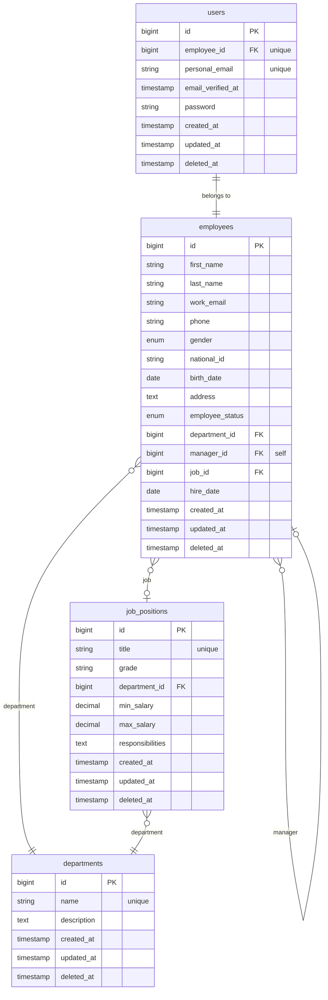
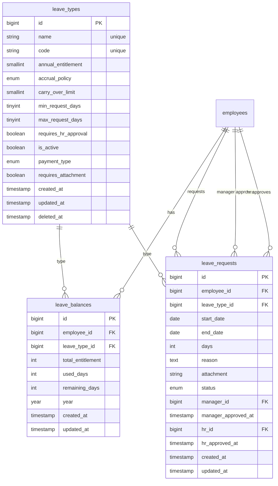
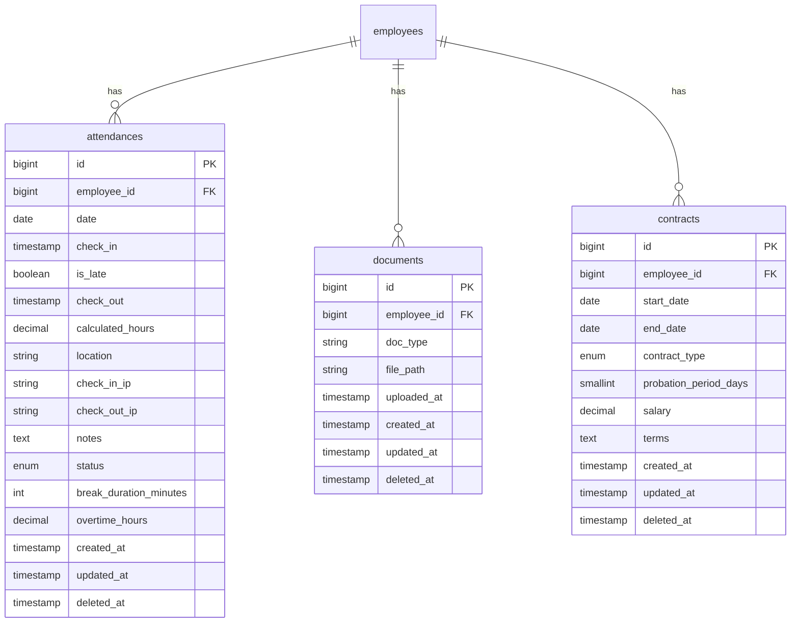
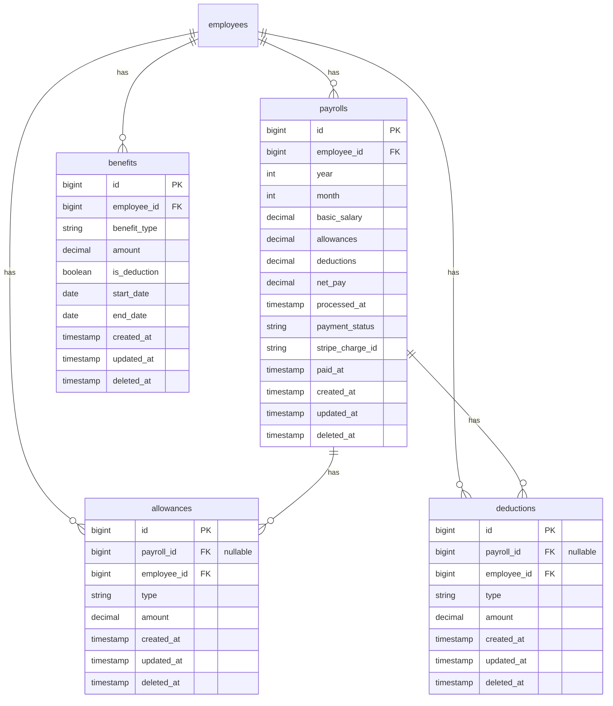
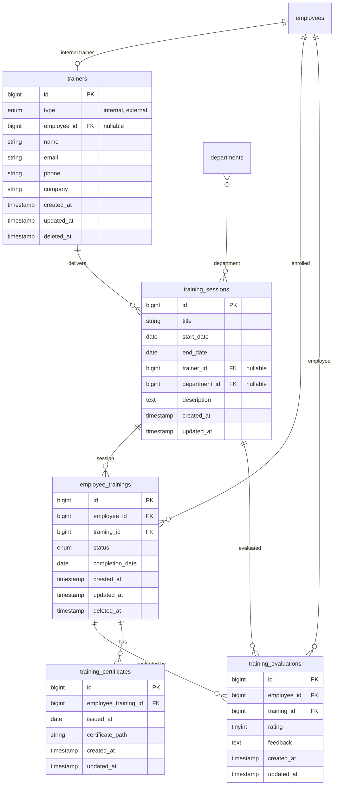
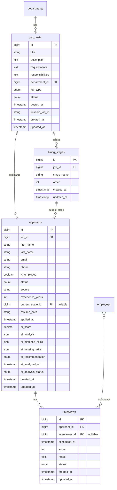
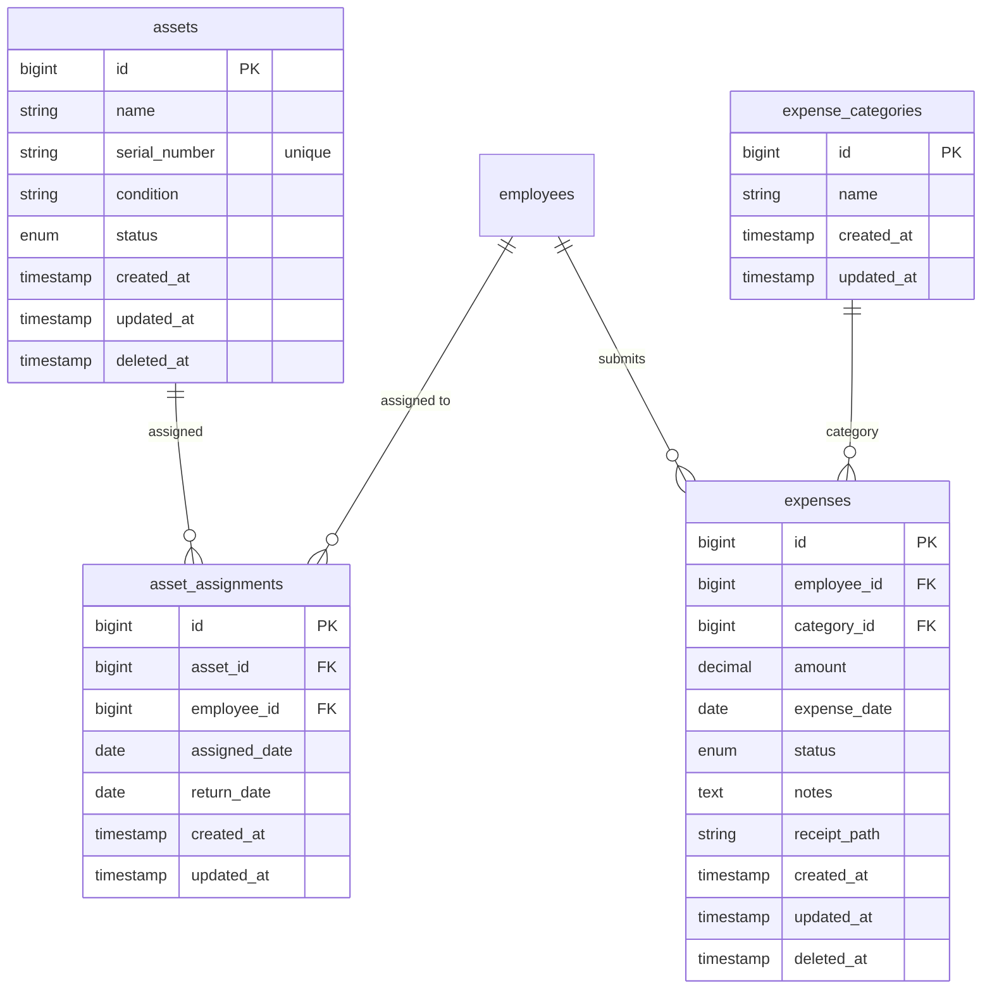
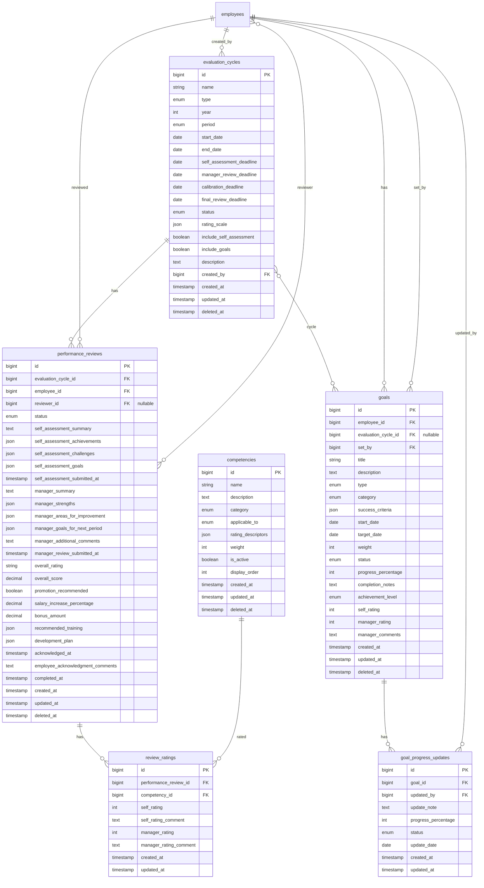
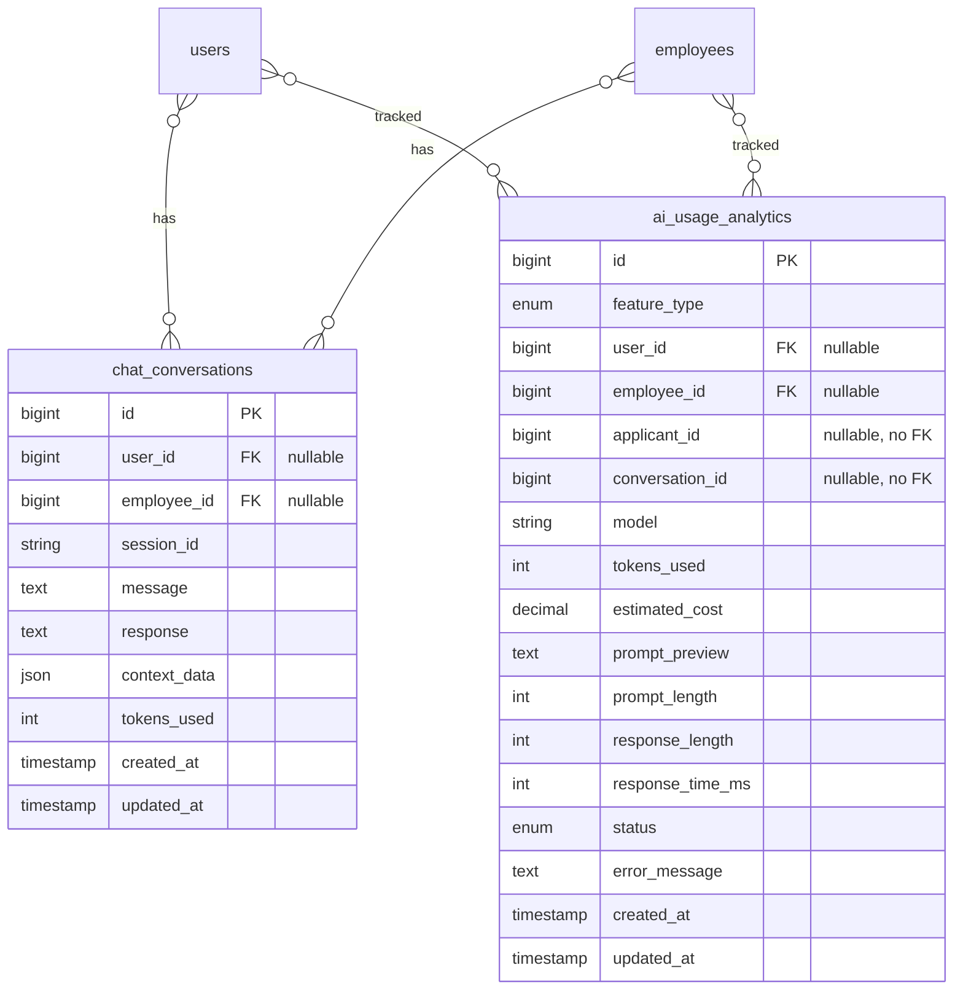
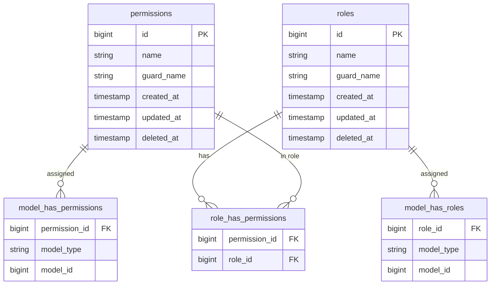

# IntelliHR Database — Entity Relationship Diagram

This document describes the **actual** IntelliHR database schema (from Laravel migrations), with consistent naming, relationships, and cardinality.

**Conventions used:**
- **Tables:** `snake_case` (matches schema).
- **Primary key:** `id` (bigint) unless noted.
- **Foreign keys:** `*_id` referencing parent `id`; nullable where applicable.
- **Audit:** `created_at`, `updated_at` on most tables; `deleted_at` where soft deletes exist.
- **Cardinality:** `||--o{` one-to-many, `}o--o{` many-to-many (via pivot), `||--||` one-to-one.

---

## Core: Users & Employees

---

## Leave Management

---

## Attendance & Documents

---

## Payroll & Benefits

---

## Training

---

## Recruitment (Job Posts & Applicants)

---

## Assets & Expenses

---

## Performance (Evaluation Cycles, Reviews, Goals)

---

## AI & Chat

---

## Authorization (Spatie Permission)

*Note: `model_has_permissions` and `model_has_roles` use polymorphic `model_type` / `model_id` (e.g. `App\Models\User`), so User/Employee get roles and permissions via these pivot tables.*

---

## Best practices reflected in this schema

| Practice | How it appears |
|----------|----------------|
| **Consistent naming** | Tables and columns in `snake_case`; FKs as `*_id`. |
| **Single responsibility** | Each table models one entity (e.g. `leave_types` vs `leave_requests`). |
| **Explicit FKs** | All relationships use foreign key constraints. |
| **Audit trail** | `created_at`/`updated_at`; soft deletes (`deleted_at`) where needed. |
| **Normalization** | Lookups in reference tables (e.g. `leave_types`, `departments`, `job_positions`) instead of free text. |
| **Unique constraints** | Where needed (e.g. `employees.employee_id` for users, `leave_balances` per employee/type/year). |
| **Indexes** | Migrations define indexes on FKs and common filter/sort columns (not drawn in ERD for brevity). |

To regenerate or inspect the schema, use the migrations under `backend/database/migrations/`.
